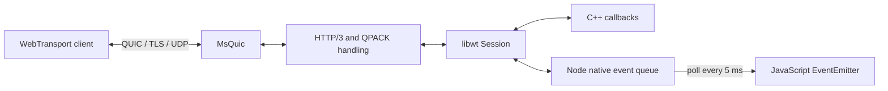

# Architecture

libwt is a shared C++17 library (`wt`, exported as `libwt::wt`). MsQuic owns QUIC,
TLS, UDP transport, and transport worker threads. libwt implements the HTTP/3
control and request handling needed to establish a WebTransport datagram session.



## Directory structure

```text
include/libwt/       Public C++ headers: server, session, configuration, statistics
src/                Native implementation and internal protocol helpers
bindings/node/      Node-API addon, CommonJS wrapper, declarations, unit tests
examples/           Native and Node echo servers and a browser datagram client
tests/              Native tests, Python clients, Node fixtures, CMake consumers
cmake/              Installed CMake package configuration template
third_party/        Vendored ls-qpack and xxHash sources and attribution
scripts/            Repository formatting driver
.github/workflows/  Linux build, format, interoperability, and consumer checks
docs/               Build, API, architecture, and contributor documentation
```

`build/` is generated and ignored. The default dependency checkout is under
`build/_deps/`. The root npm package supplies formatting tools; it is separate
from the local package in `bindings/node/`.

## Components

| Component                      | Responsibility                                                                |
| ------------------------------ | ----------------------------------------------------------------------------- |
| `include/libwt/Server.hpp`     | Public `Server`, `Session`, admission and logging callbacks                   |
| `include/libwt/Statistics.hpp` | Public server, session, and transport snapshots                               |
| `src/Server.cpp`               | Listener lifecycle, connection admission, TLS configuration and rotation      |
| `src/ServerImpl.hpp`           | Internal connection, stream, session, and send-buffer state                   |
| `src/Connection.cpp`           | MsQuic callbacks, session publication, datagrams, shutdown, transport samples |
| `src/Http3Protocol.cpp`        | Incremental stream/frame parsing, SETTINGS, CONNECT, close capsules           |
| `src/Http3Utils.*`             | QUIC variable integers, frame construction, settings, fixed limits            |
| `src/QpackUtils.cpp`           | Bounded CONNECT header decoding and validation through ls-qpack               |
| `src/Statistics.hpp`           | Atomic counters and snapshot construction                                     |
| `bindings/node/addon.cpp`      | Node-API handles, native event queues, configuration and value conversion     |
| `bindings/node/index.js`       | Polling, session identity, JavaScript event dispatch                          |
| `bindings/node/index.d.ts`     | Public TypeScript declarations                                                |

MsQuic is normally fetched at the commit recorded in `CMakeLists.txt`. ls-qpack and
xxHash are compiled into a private static codec target and linked into `wt`.
Applications do not need to include their headers.

## Connection and session lifecycle

1. The listener checks the configured connection limit and assigns a TLS configuration.
2. After the QUIC handshake, the server sends its HTTP/3 settings.
3. A CONNECT request is decoded and held until peer settings are available.
4. Protocol negotiation and application admission must both succeed. Missing native
   `on_request` callbacks reject requests. The Node binding supplies exact-match filters.
5. The server creates session state and queues HTTP 200 before publishing the session.
   If the response cannot be queued, no session or close callback is published.
6. Datagram payloads are associated with the CONNECT stream using the HTTP/3 quarter-stream ID.
7. Closing a session through the public API shuts down its QUIC connection. A peer
   close capsule or request-stream closure also ends the session.

The server owns active connections, and each connection owns its active session.
Public session handles use shared ownership; their operations refer back to a
connection through weak references. A retained session can therefore outlive
connection shutdown or server destruction, preserving counters and request metadata.

Native callbacks run on transport threads. Callbacks for different connections may
run concurrently. `Stop()` stops admission, shuts down connections, waits for
callbacks, and releases MsQuic resources. See [callback rules](api.md#callbacks-and-threading).

## Protocol scope and limits

- ALPN is `h3`; CONNECT requires `:method=CONNECT`, `:protocol=webtransport`,
  `:scheme=https`, a nonempty authority, and a path beginning with `/`.
- HTTP datagrams and WebTransport draft-02/draft-07 settings are advertised.
  A response also carries the draft-02 compatibility header. This is not a claim
  of support for every WebTransport protocol revision.
- Only one session can be accepted during a connection's lifetime. A further
  CONNECT is reset, including after the first accepted session has ended.
- Application streams, server push, and ordinary HTTP request serving are unsupported.
- QPACK dynamic table capacity and blocked-stream count are zero. Headers use the
  static table or literals; dynamic-table instructions are restricted accordingly.
- Connection migration and TLS session resumption are disabled in the MsQuic configuration.
- CLOSE capsules end sessions. Unknown capsules and draft flow-control capsules are ignored;
  a DRAIN capsule must have an empty payload.

The following constants are internal implementation limits, not configuration options:

| Limit                                                  | Value                   |
| ------------------------------------------------------ | ----------------------- |
| Buffered stream input or capsule data                  | 32,768 bytes per buffer |
| Parsed HTTP/3 frame payload / decoded header budget    | 16,384 bytes            |
| Tracked streams per connection                         | 32                      |
| Advertised peer bidirectional / unidirectional streams | 8 each                  |
| Pending sends per connection, including control sends  | 64                      |
| Application datagram absolute size ceiling             | 65,535 bytes            |
| Connection flow-control window                         | 256 KiB                 |
| Default stream receive window                          | 32 KiB                  |

The negotiated datagram limit and path MTU usually impose a much smaller payload
limit than the absolute ceiling. The HTTP/3 identifier also consumes space.
There is no API for querying a guaranteed maximum application payload size.

Node adds separate bounded queues for datagrams, logs, and lifecycle events; see
[Node queue behavior](node.md#event-delivery-and-queue-limits).
